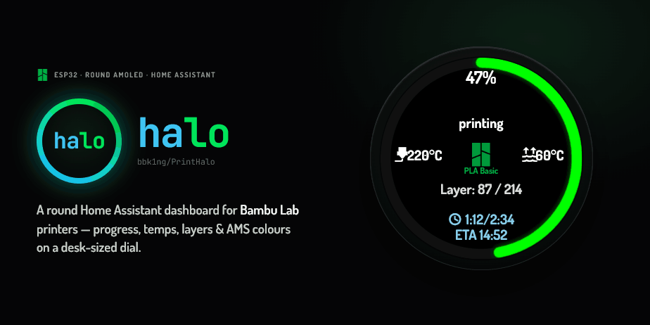
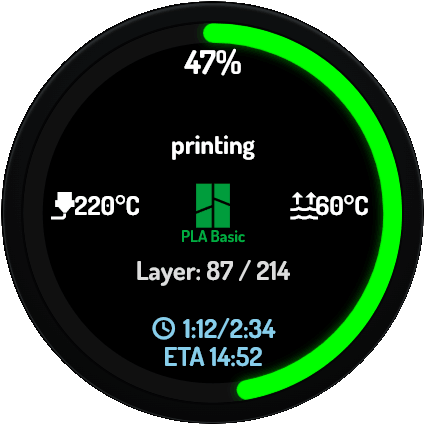
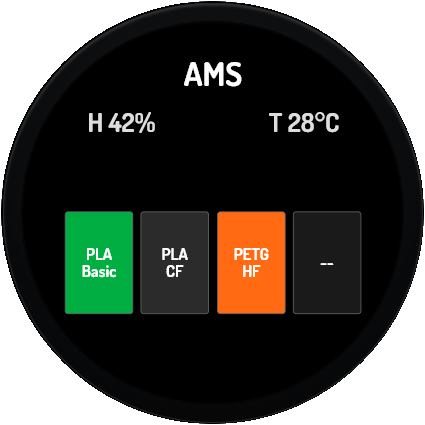
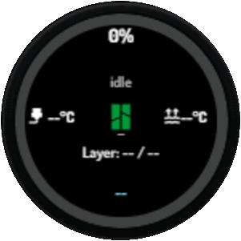
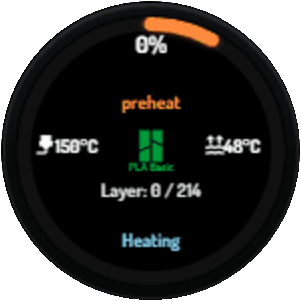
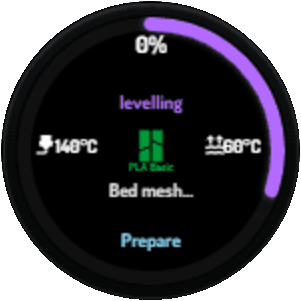
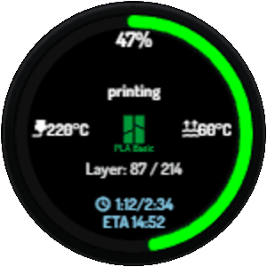
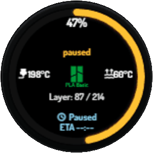
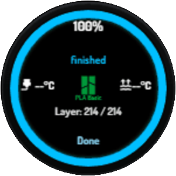
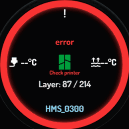

# PrintHalo



A round-display **Home Assistant dashboard for Bambu Lab 3D printers**, built for a
466 × 466 AMOLED on an ESP32-S3. The full-bleed progress ring — the *halo* — tells you
the state of a print from across the room: green while printing, blue when it's done,
grey when idle. It pulls live data over Home Assistant and shows progress, temperatures,
layer counts, remaining time, and AMS filament colours on a desk-sized dial.

> Formerly `dashboard-esp32`. Community project — not affiliated with or endorsed by Bambu Lab.

> Built with [agent-orch](https://github.com/bbk1ng/agent-orch) — multi-agent author/audit/test-gate pipeline.

## Screens

| Status | AMS |
|:------:|:---:|
|  |  |
| Progress ring, nozzle / bed temps, current layer, elapsed / ETA | Four filament slots with material name and swatch colour from the printer |

Swipe left/right — or tap the left/right half of the glass — to switch pages. The screen
auto-rotates in 90° steps and keeps text upright, and dims to 50% five minutes after a
print finishes.

## The ring at a glance

One colour tells you the state of a print from across the room:

|  |  |  |  |
|:---:|:---:|:---:|:---:|
| **Idle** — ready, grey | **Preheat** — warming up, orange | **Levelling** — bed mesh, purple | **Printing** — live progress, green |

|  |  |  | |
|:---:|:---:|:---:|:---:|
| **Paused** — on hold, amber | **Finished** — complete, blue | **Error** — needs attention | |

*(Full overview: [state-tiles.png](docs/assets/state-tiles.png))*

## Hardware

| Component | Detail |
|-----------|--------|
| MCU | ESP32-S3 (octal PSRAM, 80 MHz) |
| Display | 466 × 466 MIPI-SPI AMOLED (CO5300), quad-SPI |
| Touch | FT63x6 capacitive touch controller (I²C) |
| IMU | QMI8658 (I²C, used for auto-rotation) |

## Prerequisites

- [ESPHome](https://esphome.io/guides/installing_esphome) ≥ 2025.9.0
- Home Assistant with the [Bambu Lab integration](https://github.com/greghesp/ha-bambulab)
  installed and your printer configured

## Quick start

1. **Set your printer entity prefix** — open `esphome/round-amoled-466.yaml` and replace
   `YOUR_PRINTER_ENTITY` in the `substitutions` block with your printer's entity prefix
   (e.g. `p1s_00m00a000000`).

2. **Compile and flash**

   ```bash
   # Uses esphome on PATH, or falls back to pipx run esphome
   scripts/compile-esphome.sh

   # Flash a specific device (overrides name/friendly_name substitutions):
   scripts/compile-esphome.sh bambu-kitchen "Kitchen Bambu Dashboard"
   ```

3. **Connect to Wi-Fi** — on first boot the device creates a captive-portal AP
   (`Bambu Round Dashboard 466`). Connect and enter your Wi-Fi credentials.

4. **Add to Home Assistant** — the ESPHome integration will auto-discover the device.

Brightness is adjustable via a Home Assistant number entity exposed by the device.

## Credits / prior art

PrintHalo's two screens are adapted from other open-source projects, not built from scratch:

- **Status screen** — layout adapted from [PrintSphere](https://github.com/cptkirki/PrintSphere)
  (Cpt_Kirk, FNCL non-commercial license).
- **AMS screen** — adapted from [TurboTime29/bambu-esp32s3-ha-round-dash](https://github.com/TurboTime29/bambu-esp32s3-ha-round-dash)
  (MIT), scaled from its original 240 × 240 board to 466 × 466.

See [THIRD_PARTY_LICENSES.md](THIRD_PARTY_LICENSES.md) for full license terms.

## License

MIT — see [LICENSE](LICENSE). Bundled third-party assets (MDI font, Bambu icon) and adapted
UI/code from other projects keep their own terms — see [THIRD_PARTY_LICENSES.md](THIRD_PARTY_LICENSES.md).
